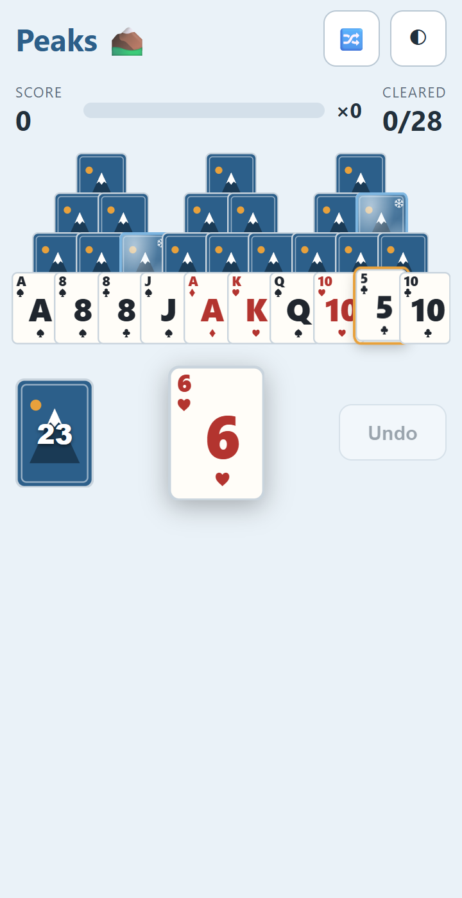
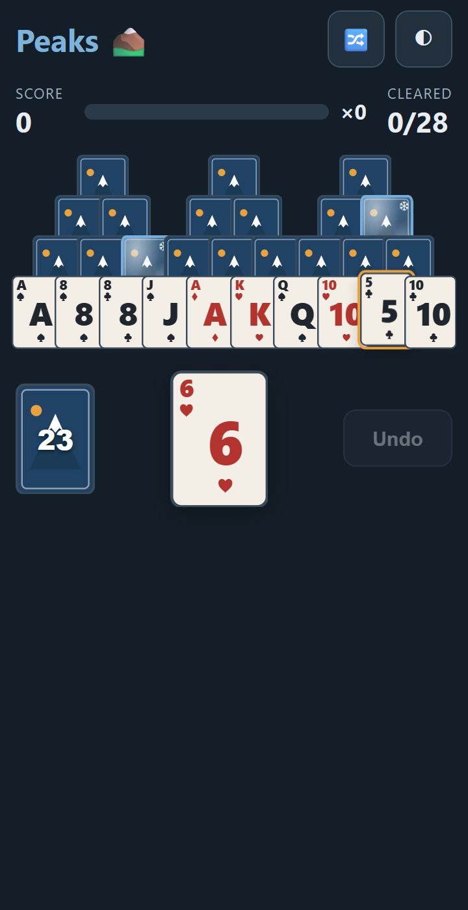
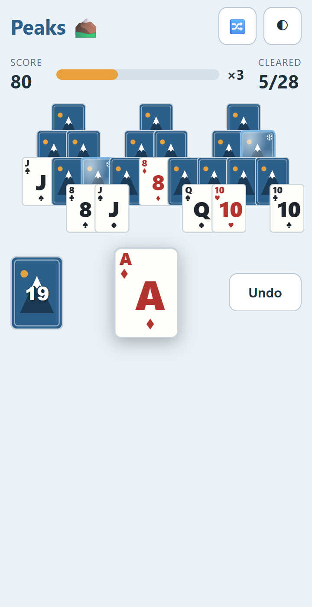
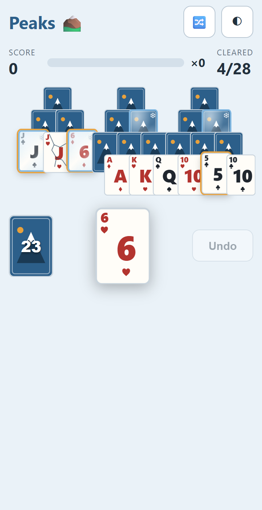
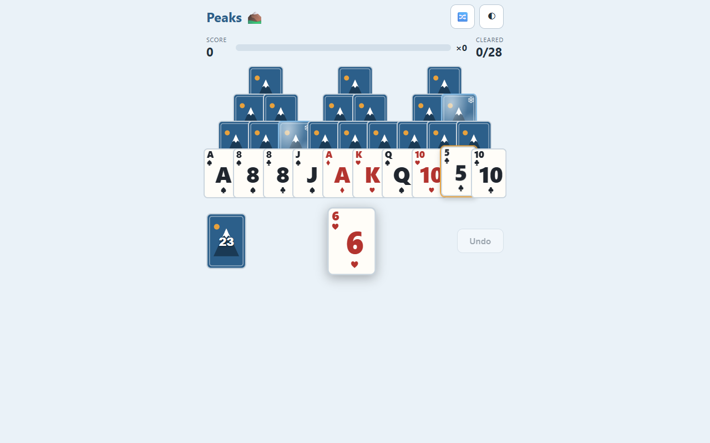
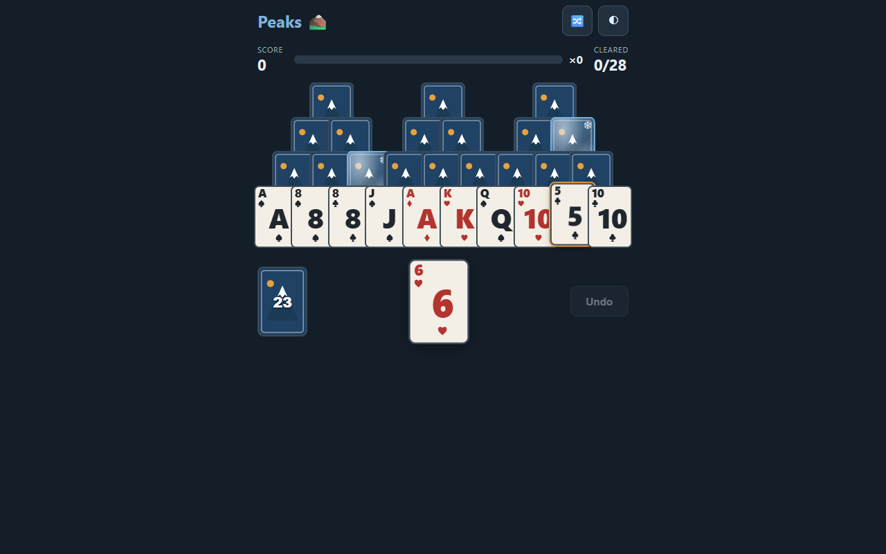

# STATUS — Phase 1, Step 4: Board UI

**Date:** 2026-08-18 · **Status: complete, 105 tests green (23 new), screenshots + GIF attached**

## What was built

A fully playable free-play board, vanilla DOM + CSS, rendered purely from engine `GameState`:

- **`src/ui/controller.ts`** — `GameController`, the mode-agnostic bridge the Step 5 daily flow
  will reuse: `newGame(seed, opts)`, `tap(slot)`, `draw()`, `undo()`, `subscribe(fn)`, plus
  `restore(state)` (daily resume / dev tooling). Illegal taps return `false` instead of throwing,
  and a **150 ms input lock** after every accepted move swallows double-taps and mid-animation
  taps (constructor-injectable for tests).
- **`src/ui/card.ts`** — code-generated SVG faces per spec: rank + suit top-left corner **and**
  large centered rank glyph; red ♥/♦, near-black ♣/♠; no court art (big K/Q/J + glyph). One
  mountain-motif back. Crack-overlay SVG. Accessible names ("Queen of Hearts").
- **`src/ui/board.ts`** — 28 slots positioned on a half-card-unit grid that mirrors the engine's
  coverage graph; percent-based, tuned at 360px, scales to a 560px max-width so desktop isn't a
  billboard. 3D flip when a card is uncovered (170 ms); clears fade-lift out (150 ms).
- **`src/ui/hud.ts`** — HUD (score, **combo meter**: fills per clear toward ×8, "×N" text, pulse
  on increment, visible 150 ms drain to zero on a draw) and tray (**pack with remaining count**,
  **pile as the elevated visual anchor**, **undo button**: "Undo · N" in daily mode / "Undo" in
  free play, disabled when unavailable).
- **Playable-card affordance** — exposed cards with a legal tap (clear _or_ crack) get a warm
  glow + 4% lift; face-down and covered cards never highlight. Stored as
  `settings.highlightPlayable` (default ON) for the later settings toggle.
- **Ice visuals** — frost is translucent with the rank fully readable (heavier at the edges, ❄
  badge); cracked shows crack lines with **no frost tint**.
- **Dark mode** — follows `prefers-color-scheme`, plus a manual toggle (system → light → dark)
  **persisted via the new `Settings` key in the Store**. Card faces stay light in dark mode for
  readability.
- **Stuck (Step 4 behavior)** — no modal: pack dims, status line shows "Stuck — N/28 cleared",
  `console.debug('[peaks] stuck')`. Results modal is Step 5. `prefers-reduced-motion` kills all
  animation durations. All controls ≥ 44px.
- **Dev/QA tooling** — `window.__peaks` hook (DEV builds only) + `scripts/screenshots.mjs` and
  `scripts/gif.mjs` (puppeteer-core driving the local Chrome/Edge — no browser download, no new
  runtime deps) so every future status report can regenerate deterministic visuals.

## How to test

```
npm test        # 105 tests, 14 files (jsdom for UI suites)
npm run dev     # play a free deal; 🔀 = new climb, ◐ = theme toggle
```

New tests: controller (subscribe/emit contract, legal/illegal dispatch, draw/undo guards,
**input-lock timing with fake clocks**, lock reset on new game) · board (28 slots at distinct
positions, bottom-row-only face-up on fresh deal, highlight exactly matches `tapAction`, click
clears + disables + re-highlights, covered clicks ignored, ice classes never on bottom row, undo
restores visuals) · HUD/tray (score & progress text, combo fill %/pulse/drain, pack count +
empty-disable, pile aria, undo label daily "Undo · 3"→"Undo · 2" vs free-play "Undo",
summit/stuck status) · settings round-trip + forward-compatible merge.

## Screenshots (docs/status/img/)

|                                                                 |                                                                                              |
| --------------------------------------------------------------- | -------------------------------------------------------------------------------------------- |
|                             |                                                            |
| 360px, light — note single playable card highlighted (5♣ on 6♥) | 360px, dark (manual toggle or system)                                                        |
|                       |                                                           |
| Combo mid-chain: ×3, bar filling, flipped row-2 cards           | Ice: frozen (frost, rank readable, ❄) + cracked (lines, no tint); crackable card highlighted |
|                     |                                                    |
| Desktop, light — 560px max-width                                | Desktop, dark                                                                                |

**GIF:** `img/p1s4-gameplay.gif` (~10s: chained clears with combo pulses, a draw with the combo
drain, an undo).

## Known issues

- Cards are ~43px wide at 360px; the tap target is the full card _including_ its overlapped
  region, so effective targets exceed 44px everywhere except the bottom row's exposed width —
  watch for complaints in QA; a hit-slop pseudo-element is the cheap fix if needed.
- The combo pulse uses a reflow-retrigger; visually fine, noted for the Step 6 perf pass.

## Decisions made

- Highlight includes crackable ice (any legal tap), not just clears — one consistent "you can
  tap this" signal.
- Frost renders on face-down iced cards too, telegraphing hazards before they flip (rank is
  hidden anyway; only the ❄ tint shows).
- `settings.highlightPlayable` persisted now (default ON); the settings UI toggle itself is
  later scope as the PM specified.

## Open questions

None blocking. (If the frost-on-face-down telegraphing is unwanted, it's a one-line CSS change.)

## Proposed plan for next step (Step 5 — Daily Summit flow)

- `src/daily/share.ts`: share text per spec §3 (day #, ⛰️/cleared, ⭐ score, emoji move log
  🟩🟨🟦⬛ truncated at 40 with "…", 🔥 streak line, URL from env) + clipboard write; unit tests
  against the spec example.
- `src/ui/modals.ts`: results modal (score, cleared, streak, best streak, day #, share button
  with "copied!" feedback, disabled "Expedition — coming soon" CTA) and first-time one-line hint.
- `src/main.ts` daily flow: landing → today's summit via `dailySeed`/`dailyDealOptions` →
  completion writes `DailyResultRecord` + streak to the Store → revisit same UTC day shows
  results + `formatCountdown` to next summit. Free play stays reachable after completion
  (banner + full "practice climb" polish is Step 6).
- Tests: share-card formatting (summit/stuck variants, truncation, streak line), daily
  controller flow with fake store + fixed timestamps (complete → locked → revisit shows results;
  new UTC day unlocks).
- Risks: clipboard API availability on iOS Safari — fallback to a select-and-copy textarea.
- Done when: full daily loop works end-to-end and the share text matches the spec byte-for-byte.
