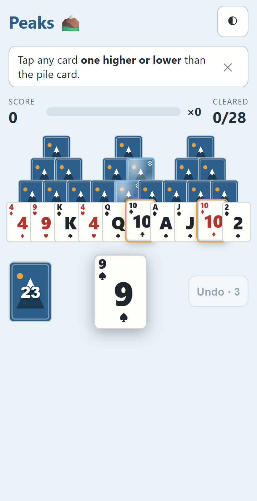
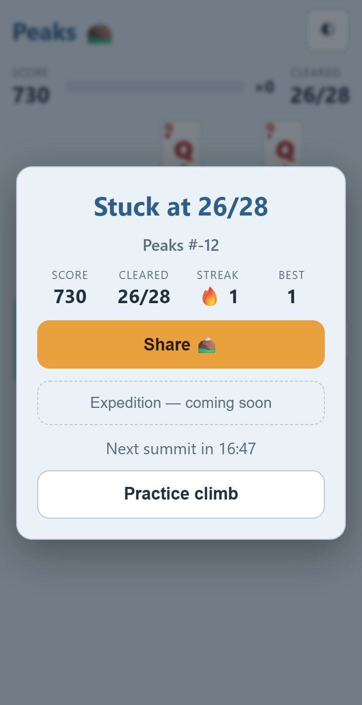
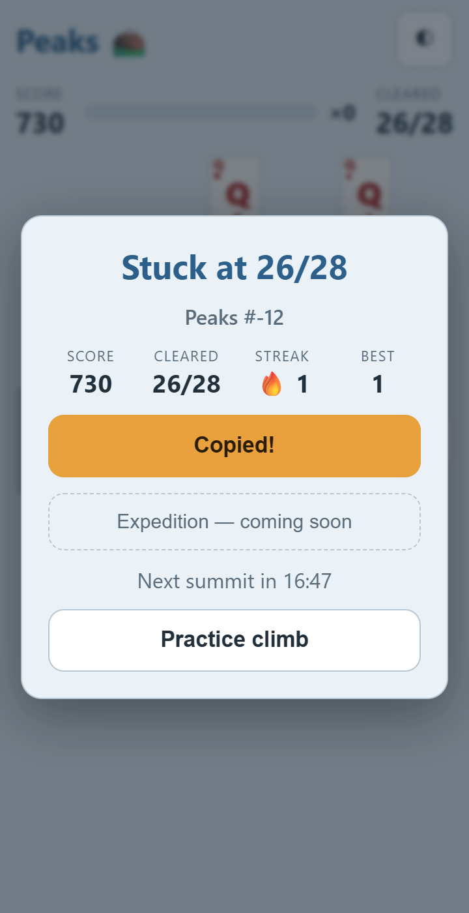
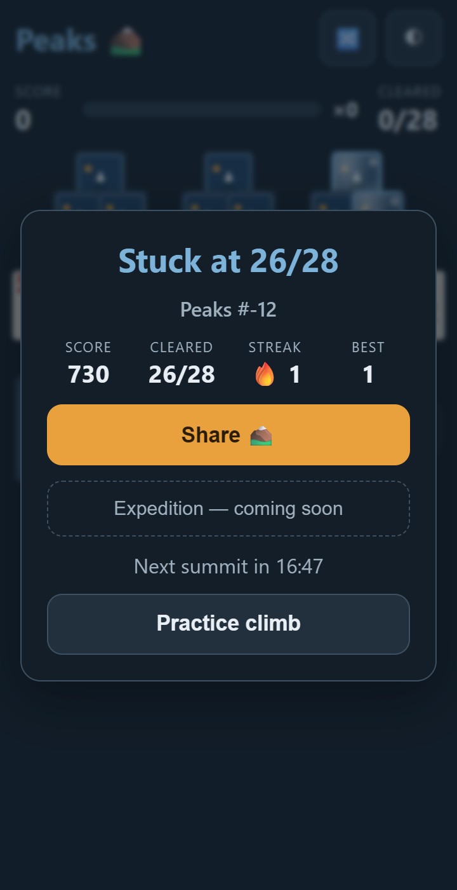

# STATUS — Phase 1, Step 5: Daily Summit flow

**Date:** 2026-08-19 · **Status: complete, 130 tests green (25 new), full loop verified end-to-end in a real browser**

## What was built

- **`src/daily/share.ts`** — `shareText()` per spec §3: `Peaks #N ⛰️ Summit!|C/28 ⭐ score`,
  emoji move log (🟩🟨🟦⬛) truncated at 40 with "…", `🔥 N-day streak`, site URL from env
  (protocol stripped). `shareOrCopy()`: **Web Share API on coarse-pointer devices** when
  available → clipboard API → **iOS-Safari textarea fallback**; returns
  `'shared' | 'copied' | 'failed'` so the button can react.
- **`src/daily/results.ts`** — `buildDailyResult` / `completeDaily`: turns a finished game into
  a `DailyResultRecord` + streak write. **Keyed to the day the game _started_** — a summit
  finished at 00:01 UTC locks the day whose board was played and leaves the new day open.
  Idempotent (existing record wins).
- **`src/ui/modals.ts`** — results modal: Summit!/Stuck title, `Peaks #N`, score / cleared /
  **streak 🔥 + best side by side** (PM note), share button with Shared!/Copied!/Copy-failed
  feedback (reverts after 2 s), disabled "Expedition — coming soon" CTA, **"Next summit in
  HH:MM" on the immediate results view** (PM note; refreshes every 15 s, flips to "New summit
  ready — refresh!" at zero), and a "Practice climb" hand-off. Plus the dismissible
  first-time hint banner.
- **`src/analytics.ts`** — typed no-op `track()` for the full event list; **`daily_start`,
  `daily_complete{won,cleared,score,draws}`, `share_click`, `share_copied`** are wired at
  their call sites now (also `app_open`, `freeplay_start`, `expedition_cta_click`), logged to
  console in dev. Step 6 only adds the PostHog transport + common props.
- **`src/main.ts`** — the daily flow: fresh visit → today's summit (`dailySeed` +
  `dailyDealOptions`, 3 undos) with the one-line hint on first ever visit (persisted
  `seenHint`, auto-dismissed on first move) → finish writes record + streak and opens the
  modal → **same-UTC-day revisit opens the results + countdown immediately** (practice board
  quietly behind it). **🔀 "new climb" is hidden in daily mode** (PM note) — visible only in
  practice. Modes are `data-mode` on the app root.
- **Controller** — now records every accepted move (`getMoves()`); with the seed this is the
  exact Phase 2 validation payload, and an integration test proves
  `replay(seed, opts, getMoves())` reproduces the final state byte-for-byte.

## How to test

```
npm test       # 130 tests, 18 files
npm run dev    # fresh profile → today's summit; finish → results; reload → revisit
```

New tests: share text **byte-for-byte against the spec example**, stuck variant, 40-entry
truncation boundary (with and without …), thousands formatting, protocol stripping ·
clipboard/web-share matrix (share on coarse pointer, cancel→copy fallback, desktop skips
share, total failure) · results record cross-midnight keying, tier capture, replayability of
the stored moves, completeDaily idempotence, streak carry across the month boundary · modal
rendering (all stats incl. best streak + countdown format), Copied!/Shared! states, disabled
CTA, practice hand-off · hint render/dismiss · controller move recording (illegal taps not
recorded) + replay integration.

**End-to-end proof (headless Chrome, fresh profile):** played today's summit to the end —
results modal opened, share click put the exact spec-format text on the OS clipboard and the
button showed "Copied!", reload showed the revisit view. Screenshots below; running
`node scripts/screenshots.mjs` against a dev server reproduces this whole loop.

## Screenshots (docs/status/img/)

|                                                |                                                |
| ---------------------------------------------- | ---------------------------------------------- |
|    |            |
| Daily start: hint, no 🔀, "Undo · 3"           | Results: stats + best, countdown, disabled CTA |
|  |            |
| Share → "Copied!" state                        | Same-day revisit: results + countdown          |

## Known issues

- **`Peaks #-12`** in today's share/modal: expected pre-launch artifact — the day index is
  negative until `VITE_LAUNCH_DATE` is re-anchored to the real launch date. Nothing to fix in
  code; flagging so nobody is surprised in QA.
- Mid-game refresh restarts the daily (same board, fresh state). The lock applies on
  completion only — an in-progress-game persistence pass is a Phase 2 candidate (noted in
  DECISIONS).

## Decisions made

- **Stuck finalizes immediately, even with undos remaining.** The spec defines stuck as an end
  state; allowing undo-out-of-stuck would be a mercy feature the PM can request later (engine
  already supports it).
- Revisit shows the results modal over a quiet practice board; "Practice climb" closes into
  free play (free play shipped in Step 4 — the banner + polish remain Step 6).
- Cross-midnight completions are recorded under the started day (tested), so the new day's
  summit stays available.

## Open questions

None blocking.

## Proposed plan for next step (Step 6 — Free-play + analytics + PWA polish)

- "Practice climb" banner with "Next summit in HH:MM" over free play; `freeplay_start`
  already wired.
- PostHog transport in `analytics.ts` behind `VITE_POSTHOG_KEY` (no-op stays without key);
  add common props `day_index`, `is_pwa`, `device` centrally; wire remaining events
  (`undo`, `pwa_install_prompt`, `pwa_installed`).
- Install prompt after 2nd session (session counter in Store); real icons; iOS meta tags.
- **Hit-slop pseudo-element for bottom-row tap targets** (carried from Step 4 per PM).
- Lighthouse mobile PWA + Performance ≥ 90 with screenshots; cross-device QA (iOS Safari,
  Android Chrome, desktop); combo-pulse reflow check.
- Done when: Lighthouse screenshots attached, event list verified (console no-op or real key),
  QA notes for all three device classes in the report.
