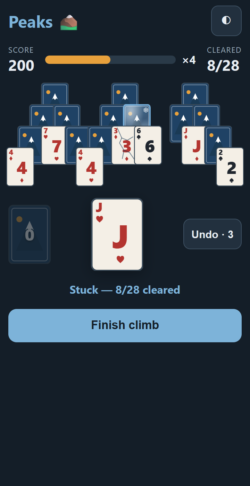
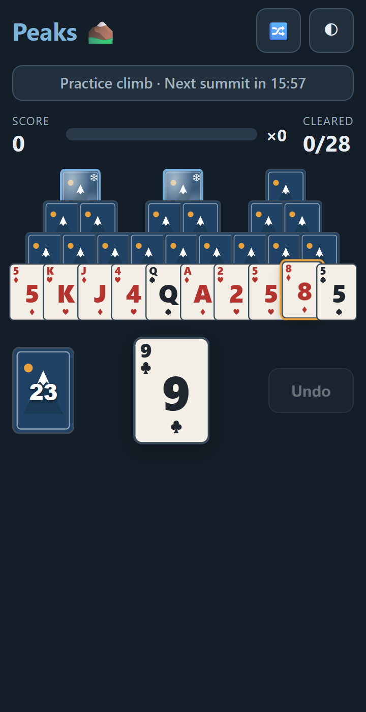

# STATUS — Phase 1, Step 6: Free-play polish, analytics, PWA

**Date:** 2026-08-19 · **Status: complete — 139 tests green (9 new), scripted QA checklist 19/19, Lighthouse 100/100/100/100**

## What was built

**The two pulled-forward PM items:**

- **Mid-game refresh resume (anti-cheat).** The in-progress daily (dateKey, seed, moves) is
  persisted to the Store after every move; on reload `loadInProgress()` rebuilds the exact
  state via `replay(seed, moves)` and hands it to `controller.restore()` — undos consumed and
  all. Stale (previous-day), already-completed, and corrupt entries are cleared and ignored;
  `completeDaily` clears the slot. Verified in the scripted QA: 4 moves → reload →
  score/draws/undos/moves/pack byte-identical.
- **Soft stuck.** `dailyPhase()` in `daily/results.ts`: `playing` / `soft-stuck` / `final`.
  Stuck with undos remaining does NOT finalize — pack dims, status reads "Stuck — N/28
  cleared", **Undo · N stays enabled**, and a **"Finish climb"** button appears (budgeted
  games only; free play keeps 🔀 instead). Finalizes on Finish tap, or automatically at
  summit / stuck-with-0-undos. Both PM test cases covered: stuck → undo → continue →
  different outcome; stuck with 0 undos → auto-finalize.

**Rest of Step 6:**

- **Practice banner** — "Practice climb · Next summit in HH:MM", free-play only, refreshes
  every 15 s. No score persistence for practice (nothing is ever written).
- **Analytics** — PostHog transport in `analytics.ts` behind `VITE_POSTHOG_KEY`
  (dynamically imported; keyless builds tree-shake it to zero bytes and stay silent no-ops).
  Common props `day_index` / `is_pwa` / `device` attached centrally. All events wired:
  `app_open{session}`, `daily_start`, `daily_complete{won,cleared,score,draws}`, `undo{mode}`,
  `share_click`, `share_copied`, `freeplay_start`, `expedition_cta_click`,
  `pwa_install_prompt`, `pwa_installed`. Verified in console no-op mode.
- **PWA install** — `beforeinstallprompt` captured and deferred; the install button appears
  **only on the results modal** (PM: never interrupt a game), and only from the 2nd session
  (session counter in the Store) when not already installed. `appinstalled` tracked.
- **Icons + meta** — richer code-drawn icons (sky gradient, layered peaks, sun; maskable safe
  zone), iOS meta tags (`apple-mobile-web-app-*`), description meta, `robots.txt`.
- **Hit-slop** — `::after` pads every card's tap target (most below, where the bottom row
  borders empty space), carried from Step 4 per PM.
- **A11y/SEO fixes from the Lighthouse run** — `<main>` landmark, `role="img"` on the pile,
  pack accessible name includes the visible count.
- `VITE_LAUNCH_DATE` provisionally **2026-08-19** → today is `Peaks #1` in QA.

## Lighthouse (mobile emulation, production build)

**Performance 100 · Accessibility 100 · Best Practices 100 · SEO 100**
(FCP 0.9 s, LCP 1.1 s, TBT 70 ms, CLS 0.) Screenshot: `img/p1s6-lighthouse.png`; full report
in `docs/status/lighthouse/`.

⚠️ Note: Lighthouse 13 **removed the PWA category** (the brief predates that). Installability
verified directly instead: valid manifest + icons served, service worker generated and
precaching (29 KB, offline-capable), install prompt captured and surfaced per the PM rule.

## QA checklist (PM-specified; scripted in `scripts/qa.mjs`, 19/19 PASS)

| #   | Check                                                                    | Result    |
| --- | ------------------------------------------------------------------------ | --------- |
| 1   | Fresh install → today's daily (seed = UTC date, 3 undos)                 | PASS      |
| 2   | First-visit hint shown; 🔀 hidden in daily; "Undo · 3"                   | PASS (×3) |
| 3   | Refresh mid-game → exact resume (score/draws/undos/moves/pack)           | PASS      |
| 4   | Stuck with undos left → soft: no modal, Finish visible, Undo enabled     | PASS (×4) |
| 5   | Undo re-opens the game (undosUsed = 1)                                   | PASS      |
| 6   | "Finish climb" finalizes → results modal                                 | PASS      |
| 7   | Share on desktop → clipboard, "Copied!", spec-format text (`Peaks #1 …`) | PASS (×2) |
| 8   | Revisit → results modal + "Next summit in HH:MM"                         | PASS (×2) |
| 9   | Practice: banner with countdown, 🔀 visible, plain "Undo"                | PASS (×3) |
| 10  | Fake clock +24 h → new daily unlocks (seed 20260820, no modal)           | PASS      |

Web Share path is unit-tested (coarse-pointer matrix incl. cancel→copy fallback); headless QA
exercises the desktop copy path. **Real-device pass (iOS Safari, Android Chrome) needs a human
with the phones** — 5-minute founder checklist: open preview URL → play → share (should open
the OS share sheet) → revisit → install to home screen (Android: browser prompt via results
modal; iOS: Safari Share → Add to Home Screen, as iOS has no install-prompt API) → open
installed app offline once. Everything scriptable has been scripted.

## Screenshots (docs/status/img/)

|                                                                                          |                                          |
| ---------------------------------------------------------------------------------------- | ---------------------------------------- |
|                                                |    |
| Soft-stuck (dark): pack dimmed at 0, Undo · 3 enabled, Finish climb; cracked ice visible | Practice: banner with countdown, 🔀 back |

Plus `img/p1s6-lighthouse.png`.

## Known issues

- iOS has no `beforeinstallprompt`; install there is manual (Add to Home Screen). A "how to
  install" hint for iOS Safari is a Phase 2 nicety.
- Analytics events fired before the PostHog chunk loads are buffered in memory (with a key
  configured); a hard close in that ~200 ms window drops them. Acceptable.

## Decisions made

- Soft-stuck "Finish climb" appears only in budgeted (daily) games — free play's 🔀 is the
  equivalent escape. Recorded in DECISIONS.md along with both PM overrides now implemented.
- Keyless builds hard-exclude posthog-js via dead-code elimination (env is baked at build
  time) — the PostHog key must be set in Vercel env vars to take effect.

## Open questions

None blocking.

## Proposed plan for next step (Step 7 — MVP first draft)

- Bug bash across the full loop on all three device classes (founder's real devices + my
  emulated passes); fix what falls out.
- Empty/edge states sweep: first-visit vs returning, streak display after a missed day,
  clipboard-denied fallback messaging, reduced-motion pass.
- Copy polish across HUD/modal/hint/share.
- README complete: run, architecture, seed explanation, **how to add a hazard** (walkthrough
  using ice as the template).
- `docs/status/STATUS_P1-S7_MVP.md` with demo GIF, known-issues list, and recommended Phase 2
  order (my current view: Expedition coin loop → Supabase auth + leaderboard → Stripe Base
  Camp — acquisition loop is already live, monetization needs the coin sink first).
- Tag `v0.1.0-mvp`.
- Done when: PM can open the preview URL on a phone, play today's summit, share it, and come
  back tomorrow for a new one.
